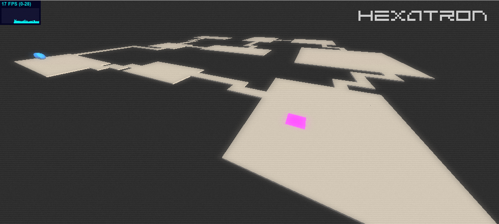

<http://chr15m.github.io/hexatron/>

# Hack #

This project is built on Clojurescript and Figwheel.

Start the server with:

	lein figwheel

Then visit <http://localhost:3449/>.

You need [Leiningen](https://github.com/technomancy/leiningen) to do that.
